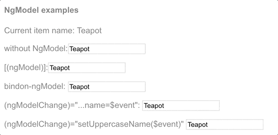

##### 10/24/2019
# Template Syntax - Built-in Directives
`Angular` offers two kinds of built-in directives: **attribute** and **structural** directives.

## Built-in Attribute Directives:
Attribute directives listen to and modify the behavior of other `HTML` elements, attributes, properties, and components.  You usually apply them to elements as if they were `HTML` attributes, hence the name.

Many `NgModules` such as the `RouterModule` and the `FormsModule` define their own attribute directives.  The most common attribute directives are as follows:
  * `NgClass`: adds/removes a set of `CSS` classes
  * `NgStyle`: adds/removes a set of `HTML` styles
  * `NgModel`: adds two-way data binding to an `HTML` form element

## `NgClass`:
Add or remove several `CSS` classes simultaneously with `ngClass`.

```html
<div [ngClass]="isSpecial ? 'special' : ''">This div is special</div>
```

  > To add/remove a _single_ class, use **class binding** rather than `NgClass`.

Consider a `setCurrentClasses()` component method that sets a component property, `currentClasses`, with an `object` that adds or removes three classes based on the `true`/`false` state of three other component properties.  Each key of the `object` is a `CSS` class name; its value is `true` if the class should be added, `false` if it should be removed.

```typescript
currentClass: { }
setCurrentClasses() {
  // CSS classes: added/removed per current state of component properties
  this.currentClass = {
    'saveable': this.canSave,
    'modified': this.isUnchanged,
    'special': this.isSpecial
  }
}
```

Adding an `ngClass` property binding to `currentClasses` sets the element's classes accordingly:

```html
<div [ngClass]="currentClasses">This div is initially saveable, unchanged, and special.</div>
```

  > Remember that in this situation you'd call `setCurrentClasses()`, both initially and when the dependent properties change.

## `NgStyle`:
Use `NgStyle` to set many inline styles simultaneously and dynamically, base on the state of the component.

### Without `NgStyle`:
For context, consider setting a _single_ style value with _style binding_, without `NgStyle`.

```html
<div [style.font-size]="isSpecial ? 'x-large' : 'smaller'">
  This div is x-large or smaller
</div>
```

### With `NgStyle`:
However, to set _many_ inline styles at the same time, use the `NgStyle` directive.

The following is a `setCurrentStyles()` method that sets a component property, `currentStyles`, with an `object` that defines three styles, based on the state of three other component properties:

```typescript
currentStyles: { }
setCurrentStyles() {
  // CSS styles: set per current state of component properties
  this.currentStyles = {
    'font-style': this.canSave ? 'italic' : 'normal',
    'font-weight': this.isUnchanged ? 'bold' : 'normal',
    'font-size': this.isSpecial ? '24px' : '12px'
  }
}
```

Adding an `ngStyle` property binding to `currentStyles` sets the element's styles accordingly:

```html
<div [ngStyle]="currentStyles">
  This div is initially italic, normal weight, and extra large (24px).
</div>
```

  > Remember to call `setCurrentStyles()`, both initially and when the dependent properties change.

## `[(ngModel)]`: Two-Way Binding:
The `NgModel` directive allows you to display a data property and update that property when the user makes changes.  Here's an example:

```html
<label for="example-ngModel">[(ngModel)]</label>
<input [(ngModel)]="currentItem.name" id="example-ngModel">
```

### Import `FormModule` to use `ngModel`:
Before using the `ngModel` directive in two-way binding, you ust import the `FormsModule` and add it to the `NgModule's` `imports` list:

`app.module.ts`:
```typescript
import { FormsModule } from '@angular/forms'; 

...

@NgModule({

  ...
  
  imports: [
    BrowserModule,
    FormsModule
  ],
  
  ...

})
export class AppModule { }
```

You could achieve the same result with separate bindings to the `<input>` element's `value` property and `input` event:

```html
<label for="without">without NgModel</label>
<input 
  [value]="currentItem.name" 
  (input)="currentItem.name=$event.target.value" 
  id="without"
>
```

The `ngModel` data property sets the element's value property and the `ngModelChange` event property listens for changes to the element's value.

### `NgModel` and Value Accessors:
The details are specific to each kind of element and therefore the `NgModel` directive only works for an element supported by a [ControlValueAccessor](https://angular.io/api/forms/ControlValueAccessor) that adapts an element to this protocol.  `Angular` provides _value accessors_ for all of the basic `HTML` form elements and the [Forms](https://angular.io/guide/forms) guide shows how to bind to them.

You can't apply `[(ngModel)]` to a non-form native element or a third-party custom component until you write a suitable value accessor.  For more information, see the API documentation on [DefaultValueAccessors](https://angular.io/api/forms/DefaultValueAccessor).

  > You don't need a value accessor for an `Angular` component that you write because you can name the value and event properties to suit `Angular`'s basic two-way binding syntax and skip `NgModel` altogether.  The `sizer` in the Two-way Binding section is an example of this technique.

Separate `ngModel` bindings are an improvement over binding to the element's native properties, but you can streamline the binding with a single declaration using the `[(ngModel)]` syntax:

```html
<label for="example-ngModel">[(ngModel)]:</label>
<input [(ngModel)]="currentItem.name" id="example-ngModel">
```

This `[(ngModel)]` syntax can only _set_ a data-bound property.  If you need to do something more, you can write the expanded form; for example, the following changes the `<input>` value to uppercase:

```html
<input 
  [ngModel]="currentItem.name" 
  (ngModelChange)="setUpperCaseName($event)" 
  id="example-uppercase"
>
```
Here are all the variations in action, including the uppercase version:



---

[Angular Docs](https://angular.io/guide/template-syntax#built-in-directives)