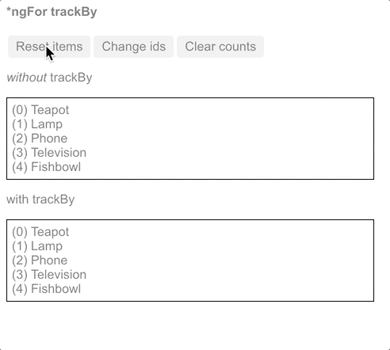

##### 10/30-31/2019
# Template Syntax - Built-in Structural Directives
**Structural directives** are responsible for `HTML` layout.  They shape or reshape the `DOM`'s structure, typically by adding, removing, and manipulating the host elements to which they are attached.

This section is an introduction to the common built-in structural directives:
  * `*ngIf`: conditionally creates or destroys subviews from the template
  * `*ngFor`: repeat a node for each item in a list
  * `*ngSwitch`: a set of directives that switch among alternative views

  > The deep details of structural directives are covered in the [Structural Directives](https://angular.io/guide/structural-directives) guide, which explains the following:
  >   * Why you prefix the directive name with an asterisk (`*`)
  >   * Using `<ng-container>` to group elements when there is no suitable host element for the directive
  >   * How to write your own structural directive
  >   * That you can only apply _one structural directive_ to an element

## `*ngIf`:
You can add/remove an element from the `DOM` by applying an `NgIf` directive to a host element.  Bind the directive to a condition expression like `isActive` in this example:

```html
<app-item-detail *ngIf="isActive" [item]="item"></app-item-detail>
```

  > Don't forget the asterisk (`*`) in from of `*ngIf`!

When the `isActive` expression returns a _truthy_ value, `NgIf` adds the `ItemDetailComponent` to the `DOM`.  When the expression is _falsy_, `NgIf` removes the `ItemDetailComponent` from the `DOM`, destroying that component and all of its sub-components.

### Show/Hide vs. `*ngIf`:
Hiding an element is different from removing it with `*ngIf`.  For comparison, the following example shows how to control the visibility of an element with a `class` or style binding:

```html
<!-- isSpecial is true -->
<div [class.hidden]="!isSpecial">Show with class</div>
<div [class.hidden]="isSpecial">Hide with class</div>

<p>ItemDetail is in the DOM but hidden</p>
<app-item-detail [class.hidden]="isSpecial"></app-item-detail>

<div [style.display]="isSpecial ? 'block' : 'none'">Show with style</div>
<div [style.display]="isSpecial ? 'none' : 'block'">Hide with style</div>
```

When you hide an element, that element and all of its descendants remain in the `DOM`.  All components for those elements stay in memory and `Angular` may continue to check for changes.  You could be holding onto considerable computing resources and degrading performance unnecessarily.

`NgIf` works differently.  When `NgIf` is `false`, `Angular` removes the element and its descendants from the `DOM`.  It destroys their components, freeing up resources, which results in a better user experience.

If you are hiding large component trees, consider `NgIf` as a more efficient alternative to showing/hiding.


### Guard Against `Null`:
Another advantage of `*ngIf` is that you can use it to guard against `null`.  Show/hide is best suited for very simple use cases, so when you need a guard, opt instead for `*ngIf`.  `Angular` will throw an error if a nested expression tries to access a property of `null`.

The following shows `NgIf` guarding two `<div>`s.  The `currentCustomer` name appears only when there is a `currentCustomer`.  The `nullCustomer` will not be displayed as long as it is `null`.

```html
<div *ngIf="currentCustomer">Hello {{ currentCustomer.name }}</div>
<div *ngIf="nullCustomer">Hello, <span>{{ nullCustomer }}</span></div>
```

## `*ngFor`:
`NgFor` is a repeater directive--a way to present a list of items.  You define a block of `HTML` that defines how a single item should be displayed and then you tell `Angular` to use that block as a template for rendering each item in the list.  The text assigned to `*ngFor` is the instruction that guides the repeater process.

The following example shows `NgFor` applied to a simple `<div>`.  (Don't forget the asterisk (`*`) in front of `ngFor`):

```html
<div *ngFor="let item of items">{{ item.name }}</div>
```

You can also apply an `NgFor` to a component element, as in the following example:

```html
<app-item-detail *ngFor="let item of items" [item]="item"></app-item-detail>
```

  > **`*NGFOR` MICROSYNTAX**:  
  > The `string` assigned to `*ngFor` is not a template expression; rather it's a _microsyntax_--a little language of its own that `Angular` interprets.  The `string` `"let item of items"` means:  
  >   * Take each item in the `items` `array`
  >   * Store it in the local `item` looping variable
  >   * Make it available to the templated `HTML` for each iteration  
  >
  > `Angular` translates this instruction into an `<ng-template>` around the host element, then uses this template repeatedly to create a new set of elements and bindings for each `item` in the list.  For more information about microsyntax, see the [Structural Directives](https://angular.io/guide/structural-directives#microsyntax) guide.

### Template Input Variables:
The `let` keyword before `item` creates a template input variable called `item`.  The `*ngFor` directive iterates over the `items` `array` returned by the parent component's `items` property and sets `item` to the current item from the `array` during each iteration.

Reference `item` withing the `*ngFor` host element as well as within its descendants to access the item's properties.  The following example references `item` first in an interpolation and then passes in a binding to the `item` property of the `<app-item-detail>` component.

```html
<div *ngFor="let item of items">{{ item.name }}</div>
<app-item-detail *ngFor="let item of items" [item]="item"></app-item-detail>
```

### `*ngFor` With Index:
The `index` property for the `NgFor` directive context returns the zero-based index of the item in each iteration.  You can capture the `index` in a template input variable and use it in the template.

The next example captures the `index` in a variable named `i` and displays it with the item name:

```html
<div *ngFor="let item of items; let i=index">{{ i + 1 }} - {{ item.name }}</div>
```

  > `NgFor` is implemented by the `NgForOf` directive.  Read more about the other `NgForOf` context values such as `last`, `even`, and `odd` in the [`NgForOf` API reference](https://angular.io/api/common/NgForOf).

### `*ngFor` with `trackBy`:
If you use `NgFor` with large lists, a small change to one item, such as removing or adding an item, can trigger a cascade of `DOM` manipulations.  For example, re-querying the server could reset a list with all new item `objects`, even when those items were previously displayed.  In this case, `Angular` sees only a fresh list of new `object` references and has no choice but to replace the old `DOM` elements with all new ones.

You can make this more efficient with `trackBy`.  Add a method to the component that returns the value `NgFor` should track.  In this case, that value is the hero's `id`.  If the `id` has already been rendered, `Angular` keeps track of it and doesn't re-query the server for the same `id`.

```typescript
trackByItems(index: number, item: Item) : number { return item.id }
```

In the microsyntax expression, set `trackBy` to the `trackByItems()` method:

```html
<div *ngFor="let item of items; trackBy: trackByItems">
  {{ item.id }} {{ item.name }}
</div>
```

Here is an illustration of the `trackBy` effect.  "Reset items" creates new items with the same `item.id`s.  "Change ids" creates new items with new `item.id`s.
  * With no `trackBy`, both buttons trigger complete `DOM` element replacement
  * With `trackBy`, only changing the `id` triggers element replacement



  > Built-in directives use only public APIs; that is, they do not have special access to any private APIs that other directives can't access.

---

[Angular Docs](https://angular.io/guide/template-syntax#built-in-structural-directives)