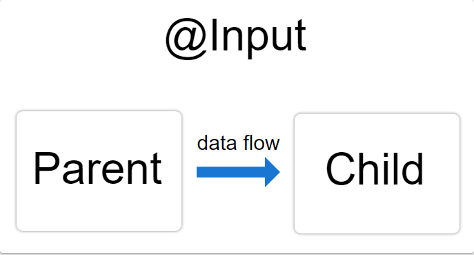
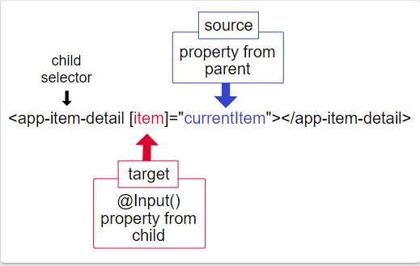

##### 11/14/2019
# Template Syntax - How To Use `@Input()`
Use the `@Input()` decorator in a child component or directive to let `Angular` know that a property in that component can receive its value from its parent component.  It helps to remember that the data flow is from the perspective of the child component.  So an `@Input()` allows data to be input _into_ the child component from the parent component.



To illustrate the use of `@Input()`, edit these parts of your app:
  * The child component class and template
  * The parent component class and template

---

## In The Child:
To use the `@Input()` decorator in a child component class, first import `Input` and then decorate the property with `@Input()`:

```typescript
import { Component, Input } from '@angular/core';

export class ItemDetailComponent {
  @Input() item: string
}
```

In this case, `@Input()` decorates the property `item`, which has a type of `string`, however, `@Input()` properties can have any type, such as `number`, `string`, `boolean`, or `object`.  The value for `item` will come from the parent component, which the next section covers.

Next, in the child component template, add the following:

```html
<p>Today's item: {{ item }}</p>
```

---

## In The Parent:
The next step is to bind the property in the parent component's template.

First, use the child's selector, here `<app-item-detail>`, as a directive within the parent component template.  Then, use property binding to bind the property in the child to the property of the parent.

```html
<app-item-detail [item]="currentItem"></app-item-detail>
```

Next, in the parent component class, designate a value for `currentItem`:

```typescript
export class AppComponent {
  currentItem = 'Television'
}
```

With `@Input()`, `Angular` passes the value for `currentItem` to the child so that `item` renders as `Television`.

The following diagram shows this structure:



The target in the square brackets, `[]`, is the property you can decorate with `@Input()` in the child component.  The binding source, the part to the right of the equal sign, is the data that the parent component passes to the nested component.

The key takeaway is that when binding to a child component's property in a parent component--that is, what's the square brackets--you must decorate the property with `@Input()` in the child component.

  > `OnChanges` and `@Input()`:
  >
  > To watch for changes on an `@Input()` property, use `OnChanges`, on of `Angular`'s lifecycle hooks. `OnChanges` is specifically designed to work with properties that have the `@Input()` decorator.

---

[Angular Docs](https://angular.io/guide/template-syntax#how-to-use-input)