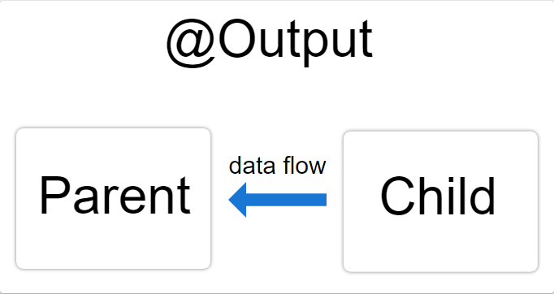

##### 11/15/2019
# Template Syntax - How To Use `@Output()`
Use the `@Output()` decorator in the child component or directive to allow data to flow from the child _out_ to the parent.

An `@Output()` property should normally be initialized to an `Angular` `EventEmitter` with values flowing out of the component as events.



Just like with `@Input()`, you can use `@Output()` on a property of the child component but its type should be `EventEmitter`.

`@Output()` marks a property in a child component as a doorway through which data can travel from the child to the parent.  The child component then has to raise an event so the parent knows something has changed.  To raise an event, `@Output()` works hand in hand with `EventEmitter`, which is a class in `@angular/core` that you use to emit custom events.

When you use `@Output()`, edit these parts of your app:
  * The child component class and template
  * The parent component class and template

The following example shows how to set up an `@Output()` in a child component that pushes data you enter in an `HTML` `<input>` to an `array` in the parent component.

  > The `HTML` element `<input>` and the `Angular` decorator `@Input()` are different.  This documentation is about component communication in `Angular` as it pertains to `@Input()` and `@Output()`.

---

## In The Child:
This example features an `<input>` where a user can enter a value and click a `<button>` that raises an event.  The `EventEmitter` then relays the data to the parent component.

First, be sure to import `Output` and `EventEmitter` in the child component class:

```typescript
import { Output, EventEmitter } from '@angular/core';
```

Next, still in the child, decorate a property with `@Output()` in the component class.  The following example `@Output()` is called `newItemEvent` and its type is `EventEmitter`, which means it's an event.

```typescript
@Output() newItemEvent = new EventEmitter<string>()
```

The different parts of the above declaration are as follows:
  * `@Output()`: a decorator `function` marking the property as a way for data to go from the child to the parent
  * `newItemEvent`: the name of the `@Output()`
  * `EventEmitter<string>`: the `@Output()`'s type
  * `new EventEmitter<string>()`: tells `Angular` to create a new event emitter and that the data it emit is of type `string`.  The type could be any type, such as `number`, `boolean`, etc.

  > For more information on `EventEmitter`, see the [`EventEmitter` API documentation](https://angular.io/api/core/EventEmitter).

Next, create an `addNewItem()` method in the same component class:

```typescript
export class ItemOutputComponent {
  @Output() newItemEvent = new EventEmitter<string>()

  addNewItem(value: string) : void {
    this.newItemEvent.emit(value)
  }
}
```

The `addNewItem()` `function` uses the `@Output()`, `newItemEvent()`, to raise an event in which it emits the value the user types into the `<input>`.  In other words, when the user clicks the add button in the UI, the child lets the parent know about the event and gives that data to the parent.

### In The Child's Template:
The child's template has two controls.  The first is as an `HTML` `<input>` with a template reference variable, `#newItem`, where the user types in an item name.  Whatever the user types into the `<input>` gets tored in the `#newItem` variable.

```html
<label>Add an item: <input #newItem></label>
<button (click)="addNewItem(newItem.value)">Add to parent's list<button>
```

The second element is a `<button>` with an event binding.  You know it's an event binding because the part to the left of the equal sign is in parentheses, `(click)`.

The `(click)` event is bound to the `addNewItem()` method in the child component class which takes as its argument whatever the value of `#newItem` is.

Now the child component has an `@Output()` for sending data to the parent and a method for raising an event.  The next step is in the parent.

---

## In The Parent:
This component in this example features a list of `items` in an `array` and a method for adding more items to the `array`.

```typescript
export class AppComponent {
  items: string[] = ['item1', 'item2', 'item3', 'item4']

  addItem(newItem: string) : void {
    this.items.push(newItem)
  }
}
```

The `addItem()` method takes an argument in the form of a `string` and then pushes, or adds, that `string` to the `items` `array`.

### In The Parent's Template:
Next, in the parent's template, bind the parent's method to the child's event.  Put the child selector, here `<app-item-output>`, within the parent component's template, `app.component.html`.

```html
<app-item-output (newItemEvent)="addItem($event)"></app-item-output>
```

The event binding, `(newItemEvent)="addItem($event)`, tells `Angular` to connect the event in the child, `newItemEvent`, to the method in the parent, `addItem()`, and that the event that the child is notifying the parent about is to be the argument of `addItem()`.  In other words, this is where the actual hand off of data takes place.  The `$event` contains the data that the user types into the `<input>` in the child template UI.

Now, in order to see the `@Output()` working, add the following to the parent's template:

```html
<ul>
  <li *ngFor="let item of items">{{ item }}</li>
</ul>
```

The `*ngFor` iterates over the items in the `items` `array`.  When you enter a value in the child's `<input>` and click the button, the child emits the event and the parent's `addItem()` method pushes the value to the `items` `array` and it renders in the list.

---

[Angular Docs](https://angular.io/guide/template-syntax#how-to-use-output)