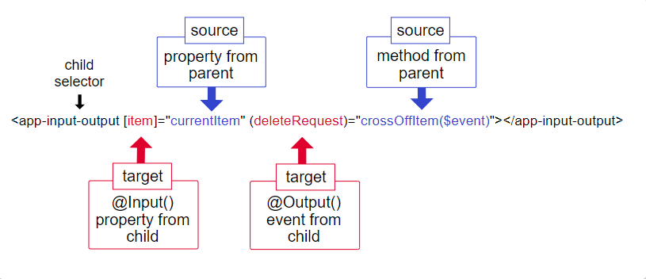

##### 11/18/2019
# Template Syntax - `@Input()` and `@Output()` Together
You can use `@Input()` and `@Output()` on the same child component as in the following:

```html
<app-input-output
  [item]="currentItem"
  (deleteRequest)="crossOffItem($event)"
></app-input-output>
```

The target, `item`, which is an `@Input()` property in the child component class, receives its value from the parent's property, `currentItem`.  When you click delete, the child component raises an event, `deleteRequest`, which is the argument for the parent's `crossOffItem()` method.

The following diagram is of an `@Input()` and an `@Output()` on the same child component and shows the different parts of each.



As the diagram shows, use inputs and outputs together in the same manner as using them separately.  Here, the child selector is `<app-input-output>` with `item` and `deleteRequest` being `@Input()` and `@Output()` properties in the child component class.  The property `currentItem` and the method `crossOffItem()` are both in the parent component class.

  >To combine property and event binding using the 'banana-in-a-box' syntax, `[()]`.

---

[Angular Docs](https://angular.io/guide/template-syntax#input-and-output-together)