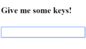

##### 12/03/2019
# User Input - Get User Input From the `$event` Object
`DOM` events carry a payload of information that may be useful to the component.  This section shows how tot bind to the keyup event of an input box to get the user's input after each keystroke.

The following code listens to the keyup event and passes the entire payload (`$event`) to the component event handler.

```ts
template: `
  <input (keyup)="onKey($event)">
  <p>{{ values }}</p>
`
```

When a user presses and releases a key, the keyup event occurs, and `Angular` provides a corresponding `DOM` event `object` in the `$event` variable which this code passes as a parameter to the component's `onKey()` method.

```ts
export class KeyUpComponent {
  values: string = ''

  onKey(event: any) : void {
    this.values += `${event.target.value} | ` 
  }
}
```

The properties of an `$event` `object` var depending on the type of `DOM` event.  For example, a mouse events includes different information than an input box editing event.

All [standard `DOM` event objects](https://developer.mozilla.org/en-US/docs/Web/API/Event) have a `target` property, a reference to the element that raised the event.  In this case, `target` refers to the `<input>` element and `event.target.value` returns the current contents of that element.

After each call, the `onKey()` method appends the contents of the input box value to the list oin the component's `values` property, followed by a separator character (`|`).  The interpolation displays the accumulating input box changes from teh `values` property.

Suppose the user enters the letters 'abc', and then backspaces to remove them one by one.  Here's what the UI displays:

```
a | ab | abc | ab | a | |
```



  > Alternatively, you could accumulate the individual keys themselves by substituting `event.key` for `event.target.value` in which case the same user input would produce:
  >
  > ```
  > a | b | c | backspace | backspace | backspace |
  > ```

## Type the `$event`:
the example above casts the `$event` as an `any` type.  That simplifies the code at a cost.  There is no type information that could reveal properties of the event object and prevent silly mistakes.

The following example rewrites the method with types:

```ts
export class KeyUpComponent {
  values: string = ''

  onKey(event: KeyboardEvent) : void {
    this.values += `${(event.target as HTMLInputElement).value} | `
  }
}
```

The `$event` is now a specific `KeyboardEvent`.  Not all elements have a value property so it casts `target` to an input element.  The `OnKey` method more clearly expresses what it expects from the template and how it interprets the event.

## Passing `$event` Is A Dubious Practice:
Typing the event object reveals a significant objection to passing the entire `DOM` event into the method:  the component has too much awareness of the template details.  It can't extract information without knowing more than it should about the `HTML` implementation.  That breaks the separation of concerns between the template and the component.

The next section shows how to use template reference variables to address this problem.

---

[Angular Docs](https://angular.io/guide/user-input#get-user-input-from-the-event-object)