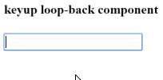

##### 12/04/2019
# User Input - Get User Input From A Template Reference Variable
There's another way to get the user data: use `Angular` template reference variables!  These variables provide direct access to an element from within the template.  To declare a template reference variable, precede an identifier with a hash (`#`).

The following example uses a template reference variable to implement a keystroke in a simple template:

```ts
@Component({
  selector: 'app-look-back',
  tempalte: `
    <input #box (keyup)="0>
    <p>{{ box.value }}</p>
  `
})
export class LookbackComponent { }
```

The template reference variable named `box`, declared on the `<input>` element, refers to the `<input>` element itself.  The code uses the box variable to et the input element's value and display it with interpolation between `<p>` tags.

The template is completely self-contained.  It doesn't bind to the component, and the component does nothing.

Type something in the input box and watch the display update with each keystroke.



  > **NOTE**: This wont work at all unless you bind to an event!
  >
  > `Angular` updates the bindings (and therefore the screen) only if the app does something in response to asynchronous events, such as keystrokes.  This example code binds the `keyup` event to the number 0, the shortest template statement possible.  While the statement does nothing useful, it satisfies `Angular`'s requirement so that `Angular` will update the screen.

It's easier to get to the input box with the template reference variable than to go through the `$event` object.  Here's a rewrite of the previous `keyup` example that uses a template reference variable to get the user's input.

```ts
@Component({
  selector: 'app-key-up2',
  template: `
    <input #box (keyup)="onKey(box.value)">
    <p>{{ values }}</p>
  `
})
export class KeyUpComponent_V2 {
  values: string = ''

  onKey(values: string) : void {
    this.values += `${value} | `
  }
}
```

A nice aspect of this approach is that the component gets clean data values from the view.  It no longer requires knowledge of the `$event` and its structure.

---

[Angular Docs](https://angular.io/guide/user-input#get-user-input-from-a-template-reference-variable)