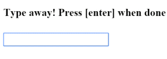

##### 12/05/2019
# User Input - Key Event Filtering (with `key.enter`)
The `(keyup)` event handler hears _ever keystroke_.  Sometimes only the _Enter_ key matters, because it signals that the user has finished typing.  One way to reduce the noise would be to examine every `$event.keyCode` and take action only when the key is _Enter_.

There's an easier way:  bind to `Angular`'s `keyup.enter` pseudo-event.  Then `Angular` calls the event handler only when the user presses _Enter_.

```ts
@Component({
  selector: 'app-key-up3',
  template: `
    <input #box (keyup.enter)="onEnter(box.value)">
    <p>{{ value }}</p>
  `
})
export class KeyUpComponent_V3 {
  value: string = ''

  onEnter(value: string) : void {
    this.value = value
  }
}
```

Here's how it works:



---

[Angular Docs](https://angular.io/guide/user-input#key-event-filtering-with-keyenter)