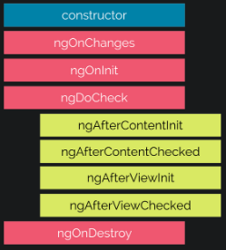

##### 12/06/2019
# Lifecycle Hooks - Lifecycle Sequence
_After_ crating a component/directive by calling its constructor, `Angular` calls the lifecycle hook methods in the following sequence at specific moments:

| Hook | Purpose and Timing |
|---|---|
| `ngOnChanges()` | Respond when `Angular` (re)sets data-bound input properties.  The method receives a `SimpleChanges` `object` of current and previous property values. Called _before_ `ngOnInit()` and whenever one or more data-bound input properties change. |
| `ngOnInit()` | Initialize the directive/component after `Angular` first displays the data-bound properties and sets the directive/component's input properties. Called _once_, after the _first_ `ngOnChanges()`. |
| `ngDoCheck()` | Detect and act upon changes that `Angular` can't or won't detect on its own. Called during every change detection run, immediately _after_ `ngOnChanges()` and `ngOnInit()`. |
| `ngAfterContentInit()` | Respond _after_ `Angular` projects external content into the component's view/the view that a directive is in. Called _once after_ the _first_ `ngDoCheck()`. |
| `ngAfterContentChecked()` | Respond _after_ `Angular` checks the content projected into the directive/component. Called _after_ the `ngAfterContentInit()` and every subsequent `ngDoCheck()`. |
| `ngAfterViewInit()` | Respond _after_ `Angular` initializes the component's views and child views/the view that a directive is in. Called _once after_ the _first_ `ngAfterContentChecked()`. |
| `ngAfterViewChecked()` | Respond _after_ `Angular` checks the component's views and child views/the view that a directive is in. Called _after_ the `ngAfterViewInit()` and every subsequent `ngAfterContentChecked()`. |
| `ngOnDestroy()` | Cleanup just before `Angular` destroys the directive/component.  Unsubscribe Observables and detach event handlers to avoid memory leaks. Called _just before_ `Angular` destroys the directive/component. |

---

[Angular Docs](https://angular.io/guide/lifecycle-hooks#lifecycle-sequence)