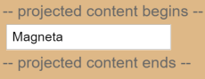

##### 12/17/2019
# Lifecycle Hooks - AfterContent
The _AfterContent_ sample explores the `AfterContentInit()` and `AfterContentChecked()` hooks that `Angular` projects external content into the component.

## Content Projection:
_Content projection_ is a way to import `HTML` content from outside the component and insert that content into the component's template in a designated spot.

  > `AngularJS` developers know this technique as _transclusion_.

Consider this variation on the previous _AfterView_ example.  This time, instead of including the child view within the template, it imports the content from the `AfterContentComponent`'s parent.  Here's the parent's template:

```html
<after-content>
  <app-child></app-child>
</after-content>
```

Notice that the `<app-child>` tag is tucked between the `<after-content>` tags.  Never put content between a component's element tags _unless you intend to project that content into the component_.

Now look at the component's template:

```html
<div>-- project content begins --</div>
  <ng-content></ng-content>
<div>-- project content ends --</div>
```

The `<ng-content>` tag is a _placeholder_ for the external content.  It tells `Angular` where to insert that content.  In this case, the projected content is the `<app-child>` from the parent.



  > The telltale signs of _content projection_ are twofold:
  >   * `HTML` between component element tags
  >   * The presence of `<ng-content>` tags in the component's template

## AfterContent Hooks:
_AfterContent_ hooks are similar to the _AfterView_ hooks.  The key difference is in the child component.
  * The _AfterView_ hooks concern `ViewChildren`, the child components whose element tags appear _within_ the component's template
  * The _AfterContent_ hooks concern `ContentChildren`, the child components that `Angular` projected into the component

The following `AfterContent` hooks take action based on changing values in the _content child_, which can only be reached by querying for them via the property decorated with [`@ContentChild`](https://angular.io/api/core/ContentChild).

```ts
export class AfterContentComponent implements AfterContentChecked, AfterContentInit {
  private prevHero: string = ''
  comment: string = ''

  // Query for a CONTENT child of type ChildComponent
  @ContentChild(ChildComponent, { static: false }) contentChild: ChildComponent

  ngAfterContentInit() {
    // contentChild is set after the content has been initialized
    this.logIt('AfterContentInit')
    this.doSomething()
  }

  ngAfterContentChecked() {
    // contentChild is updated after the content has been checked
    if (this.prevHero ==- this.contentChild.hero) {
      this.logIt('AfterContentChecked (no change)')
    } else {
      this.prevHero = this.contentChild.hero
      this.logIt('AfterContentChecked')
      this.doSomething()
    }
  }
  ...
}
```

## No Unidirectional Flow Worries with AfterContent:
This component's `doSomething()` method updates the component's data-bound `comment` property immediately.  There's no need to wait.

Recall that `Angular` calls both _AfterContent_ hooks **before** calling either of the _AfterView_ hooks. `Angular` completes composition of the projected content _before_ finishing the composition of this component's view.  There is a small window between `AfterContent...` and `AfterView...` hooks to modify the host view.

---

[Angular Docs](https://angular.io/guide/lifecycle-hooks#aftercontent)