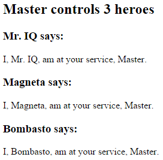

##### 12/18/2019
# Component Interaction - Pass Data From Parent to Child With Input Binding
`HeroChildComponent` has two _input properties_, typically adorned with `@Input()` decorators.

```ts
import { Component, Input } from '@angular/core';
import { Hero } from './hero';

@Component({
  selector: 'app-hero-child',
  template: `
    <h3>{{ hero.name }} says:</h3>
    <p>I, {{ hero.name }}, at at your service, {{ masterName }}</p>
  `
})
export class HeroChildComponent {
  @Input() hero: Hero
  @Input('master') masterName: string
}
```

The second `@Input()` aliases the child component property name `masterName` as `'master'`.

The `HeroParentComponent` nests the child `HeroChildComponent` inside an `*ngFor` repeater, binding its `master` `string` property to the child's `master` alias, and each iteration's `hero` instance to the child's `hero` property.

```ts
import { Component } from '@angular/core';
import { HEROES } from './hero';

@Component({
  selector: 'app-hero-parent',
  template: `
    <h2>{{ master }} controls {{ hero.length }} heroes</h2>
    <app-hero-child 
      *ngFor="let hero of heroes"
      [hero]="hero"
      [master]="master"
    ></app-hero-child
  `
})
export class HeroParentComponent {
  heroes: string = HEROES
  master: string = 'Master'
}
```

The running application displays three heroes:



## Test It:
`E2E` test that all child were instantiated and displayed as expected:

```ts
// ...
const _heroNames: string[] = ['Dr. IQ', 'Magenta', 'Bombasto']
const _masterName: string = 'Master'

it('should pass properties to children properly', () => {
  const parent = element.all(by.tagName('app-hero-parent')).get(0)
  const heroes = parent.all(by.tagName('app-hero-child'))

  for (let i = 0; i < _heroNames.length; i++) {
    let childTitle = heroes.get(i).element(by.tagName('h3')).getText()
    let childDetail = heroes.get(i).element(by.tagName('p')).getText()

    expect(childTitle).toEqual(`${_heroNames[i]} says: `)
    expect(childDetail).toContain(_masterName)
  }
})

// ...
```

---

[Angular Docs](https://angular.io/guide/component-interaction#pass-data-from-parent-to-child-with-input-binding)