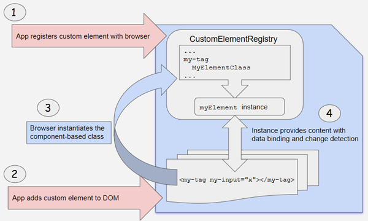

##### 1/13/2020
# `Angular` Elements - Transforming Components to Custom Elements
`Angular` provides the `createCustomElement()` `function` for converting an `Angular` component, together with its dependencies, to a custom element.  The `function` collects the component's observable properties, along with the `Angular` functionality the browser needs to create and destroy instances, and to detect and respond to changes.

The conversion process implements the `NgElementConstructor` interface, and creates a constructor class that is configured to produce a self-bootstrapping instance of your component.

Use a `JS` `function`, `customElements.define()`, to define the configured constructor and its associated custom-element tag with the browser's `CustomElementRegistry`.  When the browser encounters the tag for the registered element, it uses the constructor to create a custom-element instance.

## Mapping:
A custom element _hosts_ an `Angular` component, providing a bridge between the data and logic defined in the component and standard `DOM` APIs.  Component properties and logic maps directly into `HTML` attributes and the browser's event system.
  * The creation API parses the component looking for input properties, adn defines corresponding attributes for the custom element.  It transforms the property names to make them compatible with custom elements, which do not recognize case distinctions.  The resulting attribute names use kebab-case.
  * Component outputs are dispatched as `HTML` [Custom Events](https://developer.mozilla.org/en-US/docs/Web/API/CustomEvent), with the naem of the custom event matching the output name.  for example, for a component with `@Output() valueChange = new EventEmitter()`, the corresponding custom element will dispatch events with the name `'valueChanged'`, and the emitted data will be stored on the event's `detail` property.  If you provide an alias, that value is used; for example, `@Output('myClick') clicks = new EventEmitter<string>();` results in dispatch events with the name `'myClick'`.

---

[Angular Docs](https://angular.io/guide/elements#transforming-components-to-custom-elements)