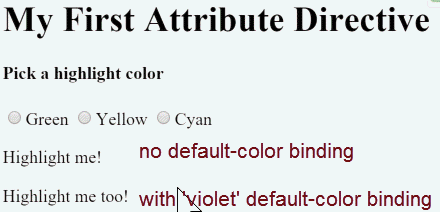

##### 2/06/2020
# Attribute Directives - Bind to a Second Property
This highlight directive has a single customizable property.  In a real app, it may need more.

At the moment, the default color--the color that prevails until the user picks a highlight color--is hard-coded as 'red'.  Let the template developer set the default color.

Add a second `@Input` property to `HighlightDirective` called `defaultColor`:

```ts
@Input() defaultColor: string;
```

Revise the directive's `onMouseEnter()` so that it first tries to highlight with the `highlightColor`, then with the `defaultColor`, and falls back to 'red' if both properties are `undefined`.

```ts
@HostListener('mouseenter') onMouseEnter() {
  this.highlight(this.highlightColor || this.defaultColor || 'red')
}
```

How do you bind to a second property when you're already binding to the `appHighlight` attribute name?

As with components, you can add as many directive property bindings as you need by stringing them along in the template.  The developer should be able to write the following template `HTML` to both bind the `AppComponent.color` and fall back to 'violet' as the default color.

```html
<p [appHighlight]="color" defaultColor="violet">Highlight Me Too!</p>
```

`Angular` knows that the `defaultColor` binding belongs to the `HighlightDirective` because you made it _public_ with the `@Input` decorator.

Here's how the harness should work when you're done coding:



---

[Angular Docs](https://angular.io/guide/attribute-directives#bind-to-a-second-property)