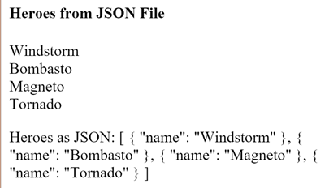

##### 2/26/2020
# Pipes - Pure and Impure Pipes
There are two categories of pipes:  _pure_ and _impure_.  Pipes are pure by default.  Every pipe you've seen so far has been pure.  You make a pipe impure by setting its pure flag to `false`.  You could make the `FlyingHeroPipe` impure like this:

```ts
@Pipe({
  name: 'flyingHeroesImpure',
  pure: false
})
```

Before doing that, understand the difference between pure and impure, starting with pure pipes.

## Pure Pipes:
`Angular` executes a _pure pipe_ only when it detects a _pure change_ to the input value.  a pure change is either a change to a primitive input value (`String`, `Number`, `Boolean`, `Symbol`) or a changed `object` reference (`Date`, `Array`, `Function`, `Object`).

`Angular` ignores changes within (composite) objects.  It won't call a pure pipe if you change an input month, add to an input `array`, or update an input `object` property.

This may seem restrictive but it's also **fast**.  An `object` reference check is fast--much faster than a deep check for differences--so `Angular` can quickly determine if it can skip both the pipe execution and a view update.

For this reason, a pure pipe is preferable when you can live with the change detection strategy.  When you can't, you _can_ use the impure pipe.

  > Or you might not use a pipe at all.  It may be better to pursue the pipe's purpose with a property of the component, a point that's discussed later in this page.

## Impure Pipes:
`Angular` executes an _impure pipe_ during every component change detection cycle.  An impure pipe is called often, as often as every keystroke or mouse-move.

With that concern in mind, implement an impure pipe with great care.  An expensive, long-running pipe could destroy the user experience.

### An Impure `FlyingHeroesPipe`:
A flip of the switch turns the `FlyingHeroesPipe` into a `FlyingHeroesImpurePipe`.  The complete implementation is as follows:

```ts
// FlyingHeroesImpurePipe
@Pipe({
  name: 'flyingHeroesImpure',
  pure: false
})
export class FlyingHeroesImpurePipe extends FlyingHeroesPipe { }
```

```ts
// FlyingHeroesPipe
import { Pipe, PipeTransform } from '@angular/core';
import { Flyer } from './heroes';

@Pipe({ name: 'flyingHeroesPipe' })
export class FlyingHeroesPipe implements PipeTransform {
  transform(allHeroes: Flyer[]) : flyer[] {
    return allHeroes.filter(hero => hero.canFly);
  }
}
```

You inherit from `FlyingHeroesPipes` to prove the point that nothing changed internally.  The only difference is the `pure` flag in the pipe metadata.

This is a good candidate for an impure pipe because the `transform` `function` is trivial and fast.

```ts
return allHeroes.filter(hero => hero.canFly);
```

You can derive a `FlyingHeroesImpureComponent` from `FlyingHeroesComponent`.

```html
<div *ngFor="let hero of (heroes | flyingHeroesImpure)">
  {{ hero.name }}
</div>
```

The only substantive change is the pipe in the template.  You can confirm in the [live example](https://stackblitz.com/angular/njnorvdmvvx?file=src%2Fapp%2Fapp.component.html) that the _flying heroes_ display updates as you add heroes, even when you mutate the `heroes` `array`.

### The Impure _AsyncPipe_:
The `Angular` `AsyncPipe` is an interesting example of an impure pipe.  The `AsyncPipe` accepts a `Promise` or `Observable` as input and subscribes to the input automatically, eventually returning the emitted values.

The `AsyncPipe` is also stateful.  The pipe maintains a subscription to the input `Observable` and keeps delivering values from that `Observable` as they arrive.

This next example binds an `Observable` of message `strings` (`message$`) to a view with the `async` pipe.

```ts
import { Component } from '@angular/core';
import { Observable, interval } from 'rxjs';
import { map, take } from 'rxjs/operators';

@Component({
  selector: 'app-hero-message',
  template: `
    <h2>Async Hero Message and AsyncPipe</h2>
    <p>Message: {{ message$ | async }}</p>
    <button (click)="resent()">Resend</button>
  `
})
export class HeroAsyncMessageComponent {
  message$: Observable<string>;

  private messages: string[] = [
    'You are my hero!',
    'You are the best hero!',
    'Will you be my hero?'
  ];

  constructor() { this.resend(); }

  resend() : void {
    this.message$ = interval(500).pipe(
      map(i => this.messages[i]),
      take(this.messages.length)
    );
  }
}
```

The Async pipe saves boilerplate in the component code.  The component doesn't have to subscribe to the async data source, extract the resolved values and expose them for binding, and have to unsubscribe when it's destroyed (a potent source of memory leaks).

### An Impure Caching Pipe:
Write one more impure pipe, a pipe that makes an HTTP request.

Remember that impure pipes are called every few milliseconds.  If you're not careful, this pipe will punish the server with requests.

In the following code, the pipe only calls the server when the requested URL changes and it caches the server response.  The code uses the [`Angular` HTTP](https://angular.io/guide/http) client to retrieve data:

```ts
import { HttpClient } from '@angular/common/http';
import { Pipe, PipeTransform } from '@angular/core';

@Pipe({
  name: 'fetch',
  pure: false
})
export class FetchJsonPipe implements PipeTransform {
  private cachedData: any = null;
  private cachedUrl: string = '';

  constructor(private http: HttpClient) { }

  transform(url: string) : any {
    if (url !== this.cachedUrl) {
      this.cachedData = null;
      this.cachedUrl = url;
      this.http.get(url).subscribe(result => this.cachedData = result);
    }

    return this.cachedData;
  }
}
```

Now demonstrate it in a harness component whose template defines two binding to this pipe, both requesting the heroes from the `heroes.json` file.

```ts
import { Component } from '@angular/core';

@Component({
  selector: 'app-hero-list',
  template: `
    <h2>Heroes from JSON File</h2>

    <div *ngFor="let hero of ('assets/heroes.json' | fetch) ">
      {{hero.name}}
    </div>

    <p>Heroes as JSON:
      {{'assets/heroes.json' | fetch | json}}
    </p>
  `
})
export class HeroListComponent { }
```

The component renders as the following: 



A breakpoint on the pipe's request for data shows the following:
  * Each binding gets its own pipe instance
  * Each pipe instance caches its own URL and data
  * Each pipe instance only calls the server once

### JsonPipe: 
In the previous code sample, the second `fetch` pipe binding demonstrates more pipe chaining.  It displays the same hero data in `JSON` format by chaining through to the built-in `JsonPipe`.

  > **Debugging With The `JSON` Pipe**:
  >
  > The [`JsonPipe`](https://angular.io/api/common/JsonPipe) provides an easy way to diagnose a mysteriously failing data binding or inspect an `object` for future binding.

## Pure Pipes and Pure `Functions`:
A pure pipe uses pure `functions`.  Pure `functions` process inputs and return values without detectable side effects.  Given the same input, they should always return the same output.

The pipes discussed earlier in this page are implemented wth pure `functions`.  The built-in `DatePipe` is a pure pipe with a pure `function` implementation. So are the `ExponentialStrengthPipe`, and `FlyingHeroesPipe`.  A few steps back, you reviewed the `FlyingHeroesImpurePipe`--an impure pipe with a pure `function`.

But always implement a _pure pipe_ with a _pure `function`_.  Otherwise, you'll see many console errors regarding expressions that changed after they were checked.
  
---

[Angular Docs](https://angular.io/guide/pipes#pure-and-impure-pipes)