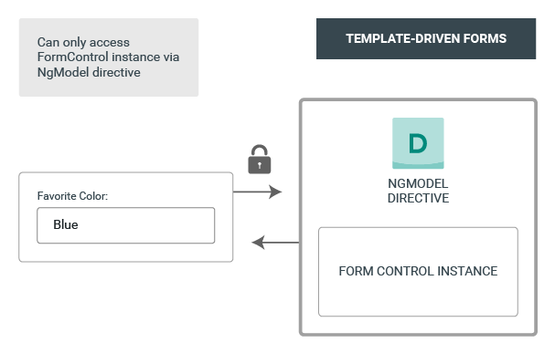

##### 3/03/2020
# Forms Introduction - Form Model Setup
Reactive and template-driven forms both use a form model to track value changes between `Angular` forms and form input elements.  The examples below show how the form model is defined and created.

## Setup In Reactive Forms:
Here's a component with an input field for a single control implemented using reactive forms.

```ts
import { Component } from '@angular/core';
import { FormControl } from '@angular/forms';

@Component({
  selector: 'app-reactive-favorite-color', 
  template: `
    Favorite color: <input type="text" [formControl]="favoriteColorControl">
  `
})
export class FavoriteColorComponent {
  favoriteColorControl = new FormControl('');
}
```

The source of truth provides the value and status of the form element at a given point in time.  In reactive forms, the form model is the source of truth.  In this example above, the form model is the `FormControl` instances.


With reactive forms, the form model is explicitly defined in the component class.  The reactive form directive (in this case, `FormControlDirective`) then links the existing `FormControl` instances to a specific form element in the view using a value accessor (`ControlValueAccessor` instance).

## Setup In Template-Driven Forms:
Here's the same component with an input field for a single control implemented using template-driven forms.

```ts
import { Component } from '@angular/core';

@Component({
  selector: 'app-template-favorite-color',
  template: `
    Favorite color: <input type="text" [(ngModel)]="favoriteColor">
  `
})
export class FavoriteColorComponent {
  favoriteColor: string = '';
}
```

In template-driven forms, the source of truth is the template.



The abstraction of the form model promotes simplicity over structure.  The template-driven form directive `NgModel` is responsible for creating and managing the `FormControl` instance for a given form element.  It's less explicit, but you no longer have direct control over the form model.
  
---

[Angular Docs](https://angular.io/guide/forms-overview#form-model-setup)