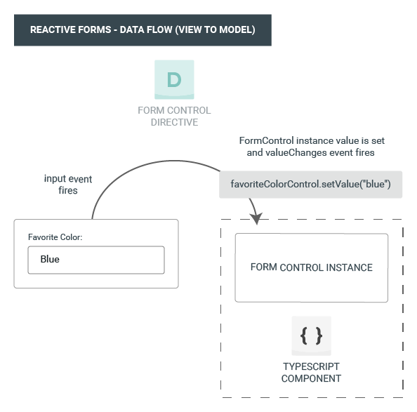
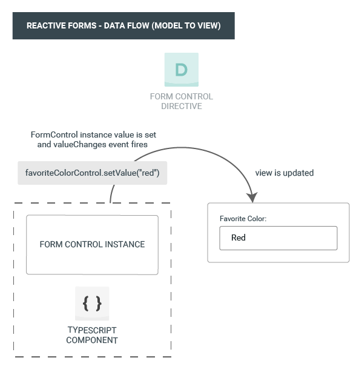
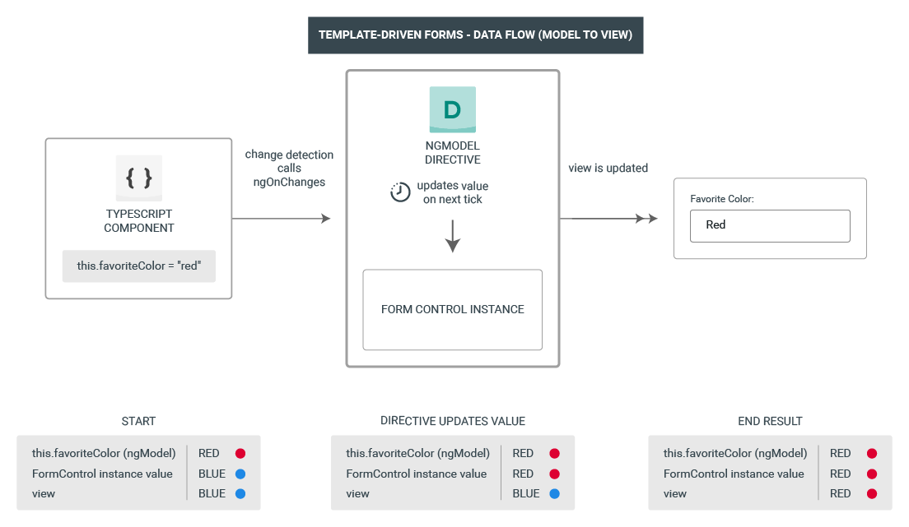

##### 3/04/2020
# Forms Introduction - Data Flow In Forms
When building forms in `Angular`, it's important to understand how the framework handles data flowing from the user or from programmatic changes.  Reactive and template-driven forms follow two different strategies when handling form input.  The data flow examples below begin with the favorite color input field example from above, and then show how changes to favorite color are handled in reactive forms compared to template-driven forms.

## Data Flow in Reactive Forms:
As described above, in reactive forms each form element in the view is directly linked to a form model (`FormModel` instance).  Updates from the view to the model to the view are synchronous and aren't dependent on the UI rendered.  The diagrams below use the same favorite color example to demonstrate how data flows when an input field's value is changed from the view and then from the model.

The steps below outline the data flow from view to model.
  1. The user types a value into the input element, in this case the favorite color _Blue_
  2. The form input element emits an 'input' event with the latest value
  3. The control value accessor listening for events on the form input element immediately relays the new value to the `FormControl` instance
  4. The `FormControl` instance emits the new value through the `valueChanges` observable
  5. Any subscribers to the `valueChanges` observable receive the new value

The steps below outline the data flow from model to view.
  1. The user calls the `favoriteColorControl.setValue()` method, which updates the `FormControl` value
  2. The `FormControl` instances emits the new value through the `valueChanges` observable
  3. Any subscribers to the `valueChanges` observable receive the new value
  4. The control value accessor on the form input element updates the element with the new value

## Data Flow In Template-Driven Forms:
In template-driven forms, each form element is linked to a directive that manages the form model internally.  The diagrams below use the same favorite color example to demonstrate how data flows when an input field's value is changed from the view and then from the model.

The steps below outline the data flow from view to model when the input value changes from _Red_ to _Blue_.
  1. The user types _Blue_ into the input element
  2. The input element emits an 'input' event with the value _Blue_
  3. The control value accessor attached to the input triggers the `setValue()` method from the `FormControl` instance
  4. The `FormControl` instance emits the new value through the `valueChanges` observable
  5. Any subscribers to the `valueChanges` observable receive the new value
  6. The control value accessor also calls the `NgModel.viewToModelUpdate()` method which emits an `ngModelChange` event
  7. Because the component template use two-way binding for the `favoriteColor` property, the `favoriteColor` property in the component is updated to the value emitted by the `ngModelChange` event (_Blue_)

The steps below outline the data flow from model to view when the `favoriteColor` changes from _Blue_ to _Red_.
  1. The `favoriteColor` value is updated in the component
  2. Change detection begins
  3. During change detection, the `ngOnChanges` lifecycle hook is called on the `NgModel` directive instance because the value of one of its inputs has changed
  4. The `ngOnChanges()` method queues as async task to set the value for the internal `FormControl` instance
  5. Change detection completes
  6. On the next tick, the task to set the `FormControl` instance value is executed
  7. The `FormControl` instance emits the latest value through the `valueChanges` observable
  8. Any subscribers to the `valueChanges` observable receive the new value
  9. The control value accessor updates the form input element in the view with the latest `favoriteColor` value

  
---

[Angular Docs](https://angular.io/guide/forms-overview#data-flow-in-forms)