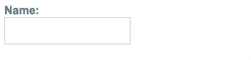

##### 3/13/2020
# Reactive Forms - Getting Started
## Step 1: Registering The Reactive Forms Module: 
To use reactive forms, import `ReactiveFormsModule` from the `@angular/forms` package and add it to your `NgModule`'s `imports` array.

```ts
import { ReactiveFormsModule } from '@angular/forms';

@NgModule({
  imports: [
    // other imports
    ReactiveFormsModule
  ],
})
export class AppModule { }
```

---

## Step 2: Generating and Importing a New Form Control:
Generate a component for the control.

```
ng g c NameEditor
```

The `FormControl` class is the basic building block whe using reactive forms.  To register a single form control, import the `FormControl` class into your component and create a new instance of the form control to save as a class property.

```ts
import { Component } from '@angular/core';
import { FormControl } from '@angular/forms';

@Component({
  selector: 'app-name-editor',
  templateUrl: './name-editor.component.html',
  styleUrls: ['./name-editor.component.css']
})
export class NameEditorComponent {
  name = new FormControl('');
}
```

Use the constructor of `FormControl` to set its initial value, which in this case is an empty `string`.  By creating these controls in your component class, you get immediate access to listen for, update, adn validate the state of the form input.

---

## Step 3: Registering The Control In The Template:
After you create the control in the component class, you must associate it with a form control element in the template.  Update the template with the form control using the `formControl` binding provided by `FormControlDirective` included in `ReactiveFormsModule`.

```html
<label>
  Name:
  <input type="text" [formControl]="name">
</label>
```

  > **NOTE**: For a more detailed list of classes and directives provided by `ReactiveFormsModule`, see the [Reactive forms API](https://angular.io/guide/reactive-forms#reactive-forms-api) section.

Using the template binding syntax, the form control is now registered to the `name` input element in the template.  The form control and `DOM` element communicate with each other:  the view reflects changes in the model, and the model reflects changes in the view.

---

## Displaying The Component: 
The form control assigned to `name` is displayed when the component is added to a template.

```html
<app-name-editor></app-name-editor>
```



---

[Angular Docs](https://angular.io/guide/reactive-forms#step-1-registering-the-reactive-forms-module)