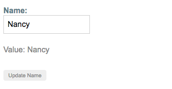

##### 3/16/2020
# Reactive Forms - Managing Control Values
## Displaying a Form Control Value: 
You can display the value in these ways:
  * Through the `valueChanges` observable where you can listen for changes in the form's value in the template using `AsyncPipe` or in the component class using the `substring()` method
  * With the `value` property, which gives you a snapshot of the current value

The following example shows you how to display the current value using interpolation in the template.

```html
<p>
  Value: {{ name.value }}
</p>
```

The displayed value changes as you update the form control element.

Reactive forms provide access to information about a given control through properties and methods provided with each instance.  These properties and methods of the underlying [AbstractControl](https://angular.io/api/forms/AbstractControl) class are used to control form state and determine when to display messages when handling validation.

## Replacing a Form Control Value:
Reactive forms have methods to change a control's value programmatically, which gives you the flexibility to update the value without user interaction.  A form control instance provides a `setValue()` method that updates teh value of the form control and validates the structure of the value provided against the control's structure.  For example, when retrieving form data from a backend API or service, use the `setValue()` method to update the control to its new value, replacing the old value entirely.

The following example adds a method to the component class to update the value of the control to _Nancy_ using the `setValue()` method.

```ts
updateName() {
  this.name.setValue('Nancy');
}
```

The form model is the source of truth for the control, so when you click the button, the value of the input is changed within the component class, overriding its current value.



  > **NOTE**: In this example, you're using a single control.  When using the `setValue()` method with a form group or form `array` instance, the value needs to match the structure of the group or `array`.

---

[Angular Docs](https://angular.io/guide/reactive-forms#displaying-a-form-control-value)