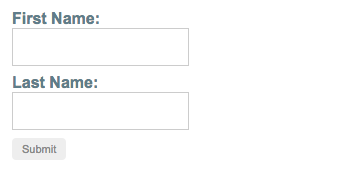

##### 3/17/2020
# Reactive Forms - Grouping Form Controls
## Step 1: Creating a `FormGroup` Instance: 
Create a property in the component class named `profileForm` and set the property to a new form group instance.  To initialize the form group, provide the constructor with an `object` of named keys mapped to their control.

For the profile form, add two form control instances with the names `firstName` and `lastName`.

```ts
import { Component } from '@angular/core';
import { FormGroup, FormControl } from '@angular/forms';

@Component({
  selector: 'app-profile-editor',
  templateUrl: './profile-editor.component.html',
  styleUrls: ['./profile-editor.component.css']
})
export class ProfileEditorComponent {
  profileForm = new FormGroup({
    firstName: new FormControl(''),
    lastName: new FormControl('')
  });
}
```

The individual form controls are now collected within a group.  A `FormGroup` instance provides its model value as an `object` reduced from the values of each control in the group.  A form group instance has the same properties (such as `value` and `untouched`) and methods (such as `setValue()`) as a form control instance.

## Step 2: Associating The `FormGroup` Model and View:
A form group tracks the status and changes for each of its controls, so if one of the controls changes, the parent control also emits a new status or value change.  The model for the group is maintained from its members.  After you define the model, you must update the template to reflect the model in the view.

```html
<form [formGroup]="profileForm">
  <label>
    First Name:
    <input type="text" formControlName="firstName">
  </label>

  <label>
    Last Name:
    <input type="text" formControlName="lastName">
  </label>
</form>
```

Note that just as a form group contains a group of controls, the _profile from_ `FormGroup` is bound to the `form` element with the `FormGroup` directive, creating a communication layer between the model and the form containing the inputs.  The `formControlName` input provided by the `FormControlName` directive binds each individual input to the form control defined in `FormGroup`.  the form controls communicate with their respective elements.  They also communicate changes to the form group instance, which provides the source of truth for the model value.

## Saving Form Data:
The `ProfileEditor` component accepts input from the user, but in a real scenario you want to capture the form value and make available for further processing outside the component. The `FormGroup` directive listens for the `submit` event emitted by the `form` element and emits an `ngSubmit` event that you can bind to a callback `function`.

Add an `ngSubmit` event listener to the `form` tag with the `onSubmit()` callback method.

```html
<form [formGroup]="profileForm" (ngSubmit)="onSubmit()">
```

The `onSubmit()` method in the `ProfileEditor` component captures the current value of `profileForm`.  Use `EventEmitter` to keep the form encapsulated and to provide the form value outside the component.  The following example uses `console.warn` to log a message to the browser console.

```ts
onSubmit() {
  // TODO: Use EventEmitter with form value
  console.warn(this.profileForm.value);
}
```

The `submit` event is emitted by the `form` tag using the native `DOM` event.  You trigger the event by clicking a button by `submit` type.  This allows the user to press the **Enter** key to submit the component form.

Use a `button` element to add a button to the bottom of the form to trigger the form submission.

```html
<button type="submit" [disabled]="!profileForm.valid">Submit</button>
```

  > **NOTE**: The button in the snippet above also has a `disabled` binding attached to it to disable the button when `profileForm` is invalid.  You aren't performing any validation yet, so the button is always enabled.

## Displaying The Component:
To display the `ProfileEditor` component that contains the form, add it to the component template.

```html
<app-profile-editor></app-profile-editor>
```

`ProfileEditor` allows you to manage the form control instances for the `firstName` and `lastName` controls within the form group instance.



---

[Angular Docs](https://angular.io/guide/reactive-forms#step-1-creating-a-formgroup-instance)