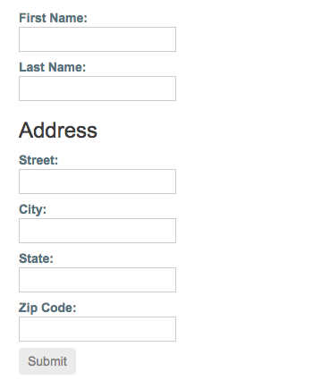

##### 3/18/2020
# Reactive Forms - Creating Nested Form Groups
When building complex forms, managing the different areas of information is easier in smaller sections, and some groups of information naturally fall into the same group.  Using a nested form group instance allows you to break large forms groups into smaller, more manageable ones.

## Step 1: Creating a Nested Group: 
An address is a good example of information that can be grouped together.  Form groups can accept both form control and form group instances as children.  This makes composing complex form models easier to maintain and logically group together.  To create a nested group in `profileForm`, add a nested address element to the form group instance.

```ts
import { Component } from '@angular/core';
import { FormGroup, FormControl } from '@angular/forms';

@Component({
  selector: 'app-profile-editor',
  templateUrl: './profile-editor.component.html',
  styleUrls: ['./profile-editor.component.css']
})
export class ProfileEditorComponent {
  profileForm = new FormGroup({
    firstName: new FormControl(''),
    lastName: new FormControl(''),
    address: new FormGroup({
      street: new FormControl(''),
      city: new FormControl(''),
      state: new FormControl(''),
      zip: new FormControl('')
    })
  });
}
```

In this example, `address` group combines the current `firstName` and `lastName` controls with the new `street`, `city`, `state`, `zip` controls.  Even though the `address` element in the form group is a child of the overall `profileForm` element in the form group, the same rules apply with value and status changes.  Changes in status and value from the nested form group propagates to the parent form group, maintaining consistency with the overall model.

## Step 2: Grouping The Nested Form In The Template:
After you update the model in the component class, update the template to connect the form group instance and its input elements.

Add the address form group containing the `street`, `city`, `state`, `zip` fields to teh `ProfileEditor` template.

```html
<div formGroupName="address">
  <h3>Address</h3>
  <label>
    Street:
    <input type="text" formControlName="street">
  </label>

  <label>
    City:
    <input type="text" formControlName="city">
  </label>

  <label>
    State:
    <input type="text" formControlName="state">
  </label>

  <label>
    Zip:
    <input type="text" formControlName="zip">
  </label>
</div>
```

The `ProfileEditor` form is displayed as one group, but the model is broken down further to represent the logical grouping areas.



  > **NOTE**: Display the value for the form group instance in the component template using the `value` property and `JsonPipe`.

---

[Angular Docs](https://angular.io/guide/reactive-forms#creating-nested-form-groups)