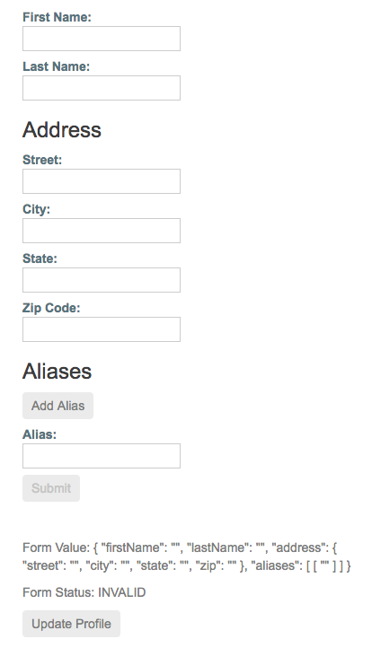

##### 3/20/2020
# Reactive Forms - Dynamic Controls Using Form `Arrays`
`FormArray` is an alternative to `FormGroup` for managing any number of unnamed controls.  As with form group instances, you can dynamically insert adn remove controls from form `array` instances, and the form `array` instance value and validation status is calculated from its child controls.  However, you don't need to define a key for each control by name, so this is a great option if you don't know the number of child values in advance.  The following example shows you how to manage an `array` of _aliases_ in `ProfileEditor`.

## Step 1: Importing The `FormArray` Class:
Import the `FormArray` class from `@angular/forms` to use for type information.  The `FormBuilder` service is ready to create a `FormArray` instance.

```ts
import { FormArray } from '@angular/forms';
```

## Step 2: Defining a `FormArray` Control:
You can initialize a form `array` with any number of controls, from zero to many, by defining them in an `array`.  Add an `aliases` property to the form group instance for `profileForm` to define the form `array`.

Use the `FormBuilder.array()` method to define the `array`, and the `FormBuilder.control()` method to populate the `array` with an initial control.

```ts
profileForm = this.fb.group({
  firstName: ['', Validators.required],
  lastName: [''],
  address = this.fb.group({
    street: [''],
    city: [''],
    state: [''],
    zip: ['']
  }),
  // new addition here
  aliases: this.fb.array([
    this.fb.control('')
  ])
});
```

The aliases control in the form group instance is now populated with a single control until more controls are added dynamically.

## Step 3: Accessing The `FormArray` Control:
A getter provides easy access to the aliases in the form `array` instance compared to repeating the `profileEditor.get()` method to get each instance.  The form `array` instance represents an undefined number of controls in an `array`.  It's convenient to access a control through a getter, and this approach is easy to repeat for additional controls.

Use the getter syntax to create an `aliases` class property to retrieve the alias's form `array` control from the parent form group.

```ts
get aliases() {
  return this.profileForm.get('aliases') as FormArray;
}
```

  > **NOTE**: Because the returned control is of the type `AbstractControl`, you need to provide an explicit type to access the method syntax for the form `array` instance.

Define a method to dynamically insert an alias control into the alias's form `array`.  The `FormArray.push()` method inserts the control as a new item in the `array`.

```ts
addAlias() {
  this.aliases.push(this.fb.control(''));
}
```

In the template, each control is displayed as a separate input field.

## Step 4: Displaying The Form `Array` In The Template:
To attach the aliases from your form model, you must add it to the template.  Similar to the `formGroupName` input provided by `FormGroupNameDirective`, `formArrayName` binds communication from the form `array` instance to the template with `FormArrayNameDirective`.

Add the template `HTML` below after the `<div>` closing the `formGroupName` element.

```html
<div formArrayName="aliases">
  <h3>Aliases</h3>
  <button (click)="addAlias()">Add Alias</button>

  <div *ngFor="let alias of aliases.controls; let i=index">
    <!-- The repeated alias template -->
    <label>
      Alias:
      <input type="text" [formControlName]="i">
    </label>
  </div>
</div>
```

The `*ngFor` directive iterates over each form control instance provided by the aliases form `array` instance.  Because form `array` elements are unnamed, you assign the index to the `i` variable and pass it to each control to bind it to the `formControlName` input.



Each time a new alias instance is added, the new form `array` instance is provided its control based on the index.  This allows you to track each individual control when calculating this status and value of the root control.

## Adding And Alias:
Initially, the form contains one `Alias` field.  To add another field, click the **Add Alias** button.  You can also validate the `array` of aliases reported by the form model displayed by `Form Value` at the bottom of the template.

  > **NOTE**: Instead of a form control instance for each alias, you can compose another form group instance with additional fields.  The process of defining a control for each item is the same.

---

[Angular Docs](https://angular.io/guide/reactive-forms#dynamic-controls-using-form-arrays)