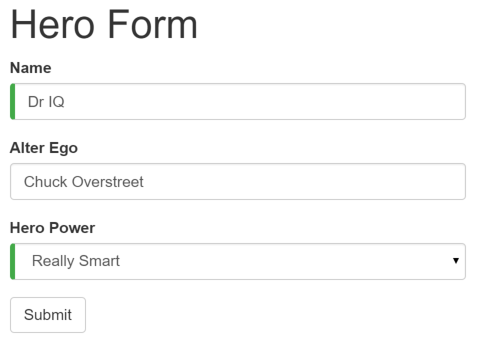
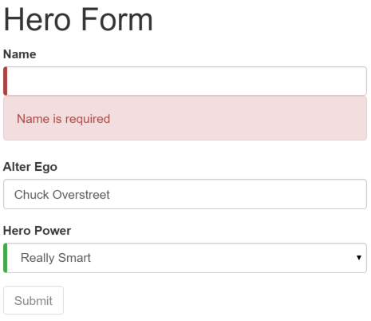

##### 3/24/2020
# Template-Driven Forms - Introduction
Forms are the mainstay of business applications.  You use forms to log in, submit a help request, place an order, book a flight, schedule a meeting, and perform other data-entry tasks.

In developing a form, it's important to create a data-entry experience that guides the user efficiently and effectively through the workflow.

## Introduction to Template-Driven Forms:
Developing forms require design skills (which are out of scope for this page), a well as framework support for _two-way data binding, change tracking, validation, adn error handling_, which you'll learn about in this section.

This page show you how to build a simple form from scratch.  Along the way you'll learn how to:
  * Build an `Angular` form with a component and template
  * Use `ngModel` to create two-way data binding for reading and writing input-control values
  * Track state changes and the validity of form controls
  * Provide visual feedback using special `CSS` classes that track the state of the controls
  * Display validation errors to users and enable/disable form controls
  * Share information across `HTML` elements using template reference variables

You can build forms by writing templates in the `Angular` template syntax with the form-specific directives and techniques described in this page.

  > You can also use a reactive (or model-driven) approach to build forms.  However, this page focuses on template-driven forms.

YOu can build almost any form with an `Angular` template--login forms, contact forms, and pretty much any business form.  YOu can lay out the controls creatively, bind them to data, specify validation rules and display validation errors, conditionally enable or disable specific controls, trigger built-in visual feedback, and much more.

`Angular` makes the process easy by handling many of the repetitive, boilerplate tasks you'd otherwise wrestle with yourself.

You'll learn to build a template-driven form that looks like this:

The _Hero Employment Agency_ uses this form to maintain personal information about heroes.  Every hero needs a job.  It's the company mission to match the right hero with the right crisis.

Two of the three fields on this form are required.  Required fields have a green bar on the left to make them easy to spot.

If you delete the hero name, the form displays a validation error in an attention-grabbing style:

  > **NOTE**: the _Submit_ button is disabled, and the 'required' bar to the left of the input control changes from green to red.

  > You can customize the colors and locations of the 'required' bar with standard `CSS`.

You'll build this form in small steps:
  1. Create the `Hero` model class
  2. Create the component that controls the form
  3. Create a template with the initial form layout
  4. Bind data properties to each form control using the `ngModel` two-way data-binding syntax
  5. Add a `name` attribute to each form-input control
  6. Add custom `CSS` to provide visual feedback
  7. Show and hide validation-error messages
  8. Handle form submission with `ngSubmit`
  9. Disable the form's _Submit_ button until the form is valid

---

[Angular Docs](https://angular.io/guide/forms)