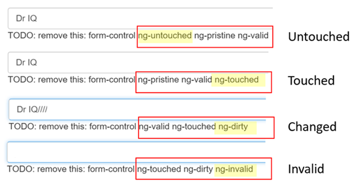

##### 4/06/2020
# Template-Driven Forms - Track Control State and Validity with `ngModel`
Using `ngModel` in a form gives you more than just two-way data binding.  It also tells you if the user touched the control, if the value changed, or if the value became invalid.

The `NgModel` directive doesn't just track state; it updates the control with special `Angular` `CSS` classes that reflect the state.  YOu can leverage those class names to change the appearance of the control.

| State | Class if `true` | Class if `false` |
|---|---|---|
| The control has been visited | `ng-touched` | `ng-untouched` |
| The control's value has changed | `ng-dirty` | `ng-pristine` |
| The control's value is valid | `ng-valid` | `ng-invalid` |

Temporarily add a template reference variable named `spy` to the _Name_ `<input>` tag and use it to display the input's `CSS` classes:

```html
<input
  type="text"
  class="form-control"
  id="name"
  required
  [(ngModel)]="model.name"
  name="name"
  #spy
>
<br>
TODO: remove this: {{ spy.className }}
```

Now run the app and look at the _Name_ input box.  Follow these steps _precisely_:
  1. Look but don't touch
  2. Click inside the name box, then click outside it
  3. Add slashes to the end of the name
  4. Erase the name

The actions and effects are as follows:


You should see the following transitions and class names:



The `ng-valid/ng-invalid` pair is the most interesting, because you want to send a strong visual signal when the values are invalid.  You also want to mark required fields.  To create such visual feedback, add definitions for the `ng-*` `CSS` class.

_Delete_ the `#spy` template reference variable and the TODO as they have served their purpose.

---

[Angular Docs](https://angular.io/guide/forms#track-control-state-and-validity-with-ngmodel)