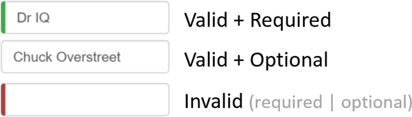

##### 4/07/2020
# Template-Driven Forms - Add Custom `CSS` For Visual Feedback
You can mark required fields and invalid data at the same time with colored bar on the left of the input box:



You achieve this effect by adding these class definitions to a new `forms.css` file that you add to the project as a sibling to `index.html`:

```css
.ng-valid[required], .ng-valid.required {
  border-left: 5px solid #42a948; /* green */
}

.ng-invalid:not(form) {
  border-left: 5px solid #a94442; /* red */
}
```

Update the `<head>` of `index.html` to include this spreadsheet:

```html
<link ref="stylesheet" href="assets/forms.css">
```

---

[Angular Docs](https://angular.io/guide/forms#track-control-state-and-validity-with-ngmodel)