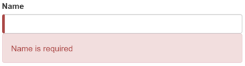

##### 4/08/2020
# Template-Driven Forms - Show and Hide Validation Error Messages
You can improve the form.  The _Name_ input box is required and clearing it turns the bar red.  That says something is wrong but the user doesn't know _what_ is wrong or what to do about it.  Leverage the control's state to reveal a helpful message.

When the user deletes the name, the form should look like this:



To achieve this effect, extend the `<input>` tag with the following:
  * A template reference variable
  * The '_is required_' message is a nearby `<div>`, which you'll display only if the control is invalid

Here's an example of an error message added to the _name_ input box:

```html
<label for="name">Name</label>
<input
  type="text"
  class="form-control"
  id="name"
  required
  [(ngModel)]="model.name"
  name="name"
  #name="ngModel"
>
<div
  [hidden]="name.valid || name.pristine"
  class="alert alert-danger"
>
  Name is required
</div>
```

You need a template reference variable to access the input box's `Angular` control from within the template. Here, you created `name` and gave it the variable `ngModel`.

  > Why `ngModel`?  A directive's [`exportAs`](https://angular.io/api/core/Directive) property tells `Angular` how to link the reference variable to the directive.  You set `name` to `ngModel` because the `ngModel` directive's `exportAs` property happens to be `ngModel`.

You control visibility of the name error message by binding properties of the `name` control to the message `<div>` element's `hidden` property.

```html
<div
  [hidden]="name.valid || name.pristine"
  class="alert alert-danger"
>
```

In this example, you hide the message when the control is valid or pristine; 'pristine' means the user hasn't changed the value since it was displayed in the form.

This user experience is the developer's choice.  Some developers want the message to display at all times.  If you ignore the `pristine` state, you would hide the message only when then the value is valid.  If you arrive in this component with a new (blank) hero or an invalid hero, you'll see the error message immediately, before you've done anything.

Some developers want the message to display only when the user makes an invalid change.  Hiding the message while the control is 'pristine' achieves this goal.  You'll see the significance of this choice when you add a new hero to the form.

The hero _Alter Ego_ is optional so you can leave that be.

Hero _Power_ selection is required.  You can add the same kind of error handling to the `<select>` if you want, but it's not imperative because the selection box already constrains the power to valid values.

Now, you'll add a new hero in this form.  Place a _New Hero_ button at the bottom of the form and bind its click event to a `newHero` component method.

```html
<button
  type="button"
  class="btn btn-default"
  (click)="newHero()"
>
  New Hero
</button>
```

```ts
newHero() {
  this.model = new Hero(42, '', '');
}
```

Run the application again, click the _New Hero_ button, and the form clears.  The _required_ bars to the left of the input box are red, indicating invalid _name_ and _power_ properties.  That's understandable as these are required fields.  The error messages are hidden because the form is pristine; you haven't changed anything yet.

Enter a name and click _New Hero_ again.  The app displays a _Name is required_ error message.  You don't want error messages when you create a new (empty) hero. Why are you getting one now?

Inspecting the element in the browser tools reveals that the _name_ input box is _no longer pristine_.  The form remembers that you entered a name before clicking _New Hero_.  Replacing the hero `object` _did not restore the pristine state_ of the form controls.

YOu have to clear all of the flags imperatively, which you can do by calling the form's `reset()` method after calling the `newHero()` method.

```html
<button
  type="button"
  class="btn btn-default"
  (click)="newHero(); heroForm.reset()"
>
  New Hero
</button>
```

Now clicking _New Hero_ resets both the form and its control flags.

---

[Angular Docs](https://angular.io/guide/forms#show-and-hide-validation-error-messages)