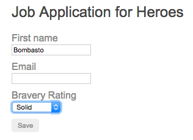

##### 5/04/2020
# Dynamic Forms - Dynamic Template
Although in this example you're modelling a job application for heroes, there are no references to any specific hero question outside the `objects` by `QuestionService`.

This is very important since it allows you to re-purpose the components for any type of survey as long as it's compatible with the _question_ `object` model. The key is the dynamic data binding of metadata used to render the form without making any hard coded assumptions about specific questions.  In addition to control metadata, you are also adding validation dynamically.

The _Save_ button is disabled until the form is in a valid state.  When the form is valid, you can click _Save_ and the app renders the current form values as `JSON`.  This proves that any user input is bound back to the data model.  Saving and retrieving the data is an exercise for another time.

The form form looks like this:

---

[Angular Docs](https://angular.io/guide/dynamic-form#dynamic-template)