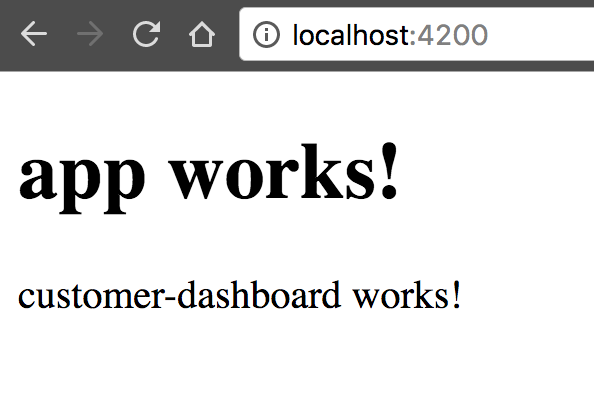

##### 6/24/2020
# Feature Modules - Rendering a Feature Module's Component Template
When the CLI generated the `CustomerDashboardComponent` for the feature module, it included a template, `customer-dashboard.component.html`, with the following markup:

```html
<p>customer-dashboard works!</p>
```
To see this `HTML` in the `AppComponent`, you first have to export the `CustomerDashboardComponent` in the `CustomerDashboardModule`. In `customer-dashboard.module.ts`, just beneath the `declarations` array, add an `exports` array containing `CustomerDashboardComponent`:

```ts
exports: [CustomerDashboardComponent]
```

Next, in the `AppComponent`, `app.component.html`, add the tag `<app-customer-dashboard>`:

```html
<h1>{{ title }}</h1>

<app-customer-dashboard></app-customer-dashboard>
```

Now, in addition to the title that renders by default, the `CustomerDashboardComponent` template renders too:



---

[Angular Docs](https://angular.io/guide/feature-modules#rendering-a-feature-modules-component-template)