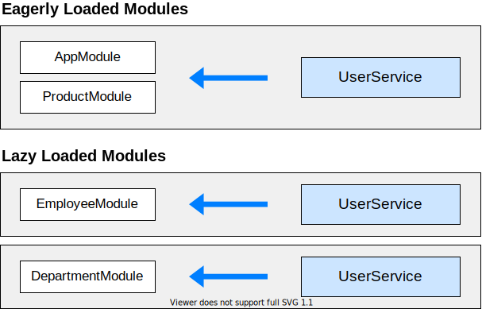

##### 7/07/2020
# Providing Dependencies - Limiting Provider Scope By Lazy Loading Modules
In the basic CLI-generated app, modules are eagerly loaded which means that they are all loaded when the app launches.  `Angular` uses an injector system to make things available between modules.  In an eagerly loaded app, the root application injector makes all of the providers in all of the modules available throughout the app.

This behavior necessarily changes when you use lazy loading.  Lazy loading is when you load modules only when you need them; for example, when routing.  They aren't loaded right away like with eagerly loaded modules.  This means that any service listed in their provider `arrays` aren't available because the root injector doesn't know about these modules.

When the `Angular` router lazy-loads a module, it creates a new injector.  This injector is a child of the root application injector.  Imagine a tree of injectors; there is a single root injector and then a child injector for each lazy loaded module.  The router adds all of the providers from the root injector to the child injector.  When the router creates a component within the lazy-loaded context, `Angular` prefers service instances created from these providers to the service instances of the application root injector.

Any component created within a lazy loaded module's context, such as by router navigation, gets the local instance of the service, not the instances in the root application injector.  Components in external modules continue to receive the instance created for the application root.

Though you can provide services by lazy loading modules, not all services can be lazy loaded.  For instance, some modules only work in the root module, such as the `Router`.  The `Router` works with the global location `object` in the browser.

As of `Angular 9`, you can provide a new instance of a service with each lazy loaded module.  The following code adds this functionality to `UserService`.

```ts
import { Injectable } from '@angular/core';

@Injectable({
  providedIn: 'any'
})
export class UserService { }
```

With `providedIn: 'any'`, all eagerly loaded modules share a singleton instance; however, lazy loaded modules each get their own unique instance, as shown in the following diagram:



---

[Angular Docs](https://angular.io/guide/providers#limiting-provider-scope-by-lazy-loading-modules)