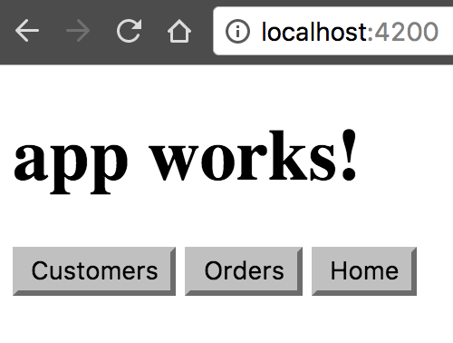
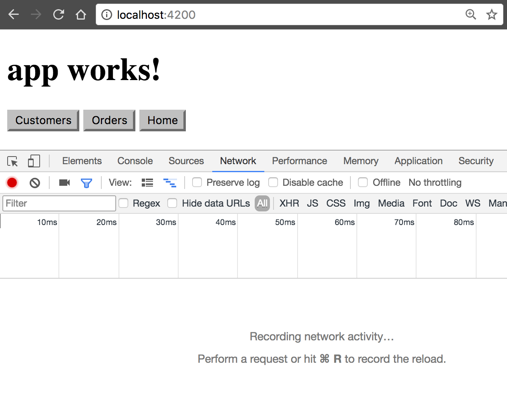
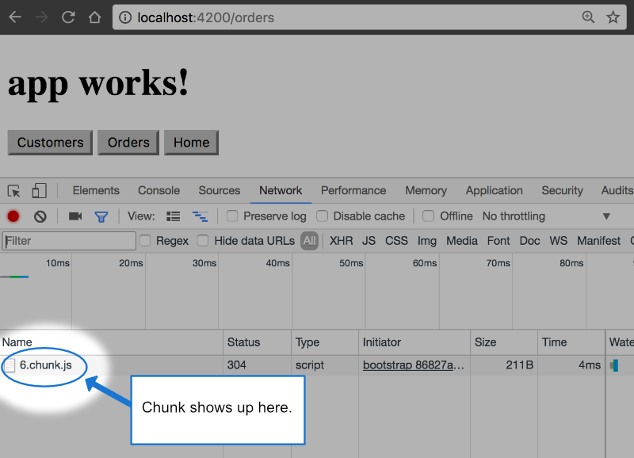
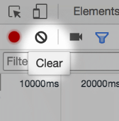

##### 7/20/2020
# Lazy Loading Feature Modules - Step-By-Step Setup
There are two main step to setting up a lazy-loaded feature module:
  1. Create the feature module with the CLI, using the `--routing` flag
  2. Configure the routes

## Set Up An App:
If you don't already have an app, you can follow the steps below to create one with the CLI.  Enter the following command where `customer-app` is the name of your app"

```
ng new customer-app --routing
```

This creates an app called `customer-app` and the `--routing` flag generates a file called `app-routing.module.ts`, which is one of the files you need to setting up lazy loading for your feature module.  Navigate into the project by issuing the command `cd customer-app`.

## Create a Feature Module with Routing:
Next, you'll need a feature module with a component to route to.  To make one, enter the following command in the terminal, where `customers` is the name of the feature module.  The path for loading the `customers` feature module is also `customers` because it is specified with the `--routing` option:

```
ng generate module customers --route customers --module app.module
```

This creates a `customers` folder with the new lazy-loadable module `CustomersModule` defined in the `customers.module.ts` file.  The command automatically declares the `CustomersComponent` inside the new feature module.

Because the new module is meant to be lazy-loaded, the command does NOT add a reference to the new feature module in the application's root module file, `app.module.ts`.  Instead, it adds the declared route, `customers` to the `routes` array declared  in the module provided as the `--module` option.

```ts
const routes: Routes = [
  {
    path: 'customers',
    loadChildren: () => import('./customers/customers.module')
      .then(m => m.CustomersModule)
  }
];
```

Notice that the lazy-loading syntax uses `loadChildren` followed by a `function` that uses the browser's built-in `import()` syntax for dynamic imports.  The import path is the relative path to the module.

### Add Another Feature Module:
Use the same command to create a second lazy-loaded feature module with routing, along with its stub component.

```
ng g m orders --route orders --module app.module
```

This creates a new folder called `orders` containing the `OrdersModule` and `OrdersRoutingModule`, along with the new `OrdersComponent` source files.  The `orders` route, specified wit the `--route` option, is added to the `routes` array inside the `app-routing.module.ts` file, suing the lazy-loading syntax.

```ts
const routes: Routes = [
  {
    path: 'customers',
    loadChildren: () => import('./customers/customers.module')
      .then(m => m.CustomersModule)
  },
  {
    path: 'orders',
    loadChildren: () => import('./orders/orders.module')
      .then(m => m.OrdersModule)
  }
];
```

## Set Up the UI:
Though you can type the URL into the address bar,  a navigation UI is easier for the user and more common.  Replace the default placeholder markup in `app.component.html` with a custom nav so you can easily navigate to your modules in the browser.

```html
<h1>{{ title }}</h1>
<button routerLink="/customers">Customers</button>
<button routerLink="/orders">Orders</button>
<button routerLink="">Home</button>
```

To see your app in the browser so far, enter the following command in the terminal window:

```
ng serve
```

Then go to `localhost:4200` where you should see 'customer-app' and three buttons:



These buttons work, because the CLI automatically added the routes to the feature modules to the `routes` array in `app.module.ts`.

## Imports and Route Configuration:
The CLI automatically added each feature module to the routes map at the application level. Finish this off by adding the default routes.  The the `app-routing.module.ts` file, update the `routes` array with the following:

```ts
const routes: Routes = [
  {
    path: 'customers',
    loadChildren: () => import('./customers/customers.module')
      .then(m => m.CustomersModule)
  },
  {
    path: 'orders',
    loadChildren: () => import('./orders/orders.module')
      .then(m => m.OrdersModule)
  },
  {
    path: '',
    redirectTo: '',
    pathMatch: 'full'
  }
];
```

The first two paths are the routes to the `CustomersModule` and the `OrdersModule`. The final entry defines the default route.  The empty path matches everything that doesn't match an earlier path.

## Inside the Feature Module:
Next, take a look at the `customers.module.ts` file. If you’re using the CLI and following the steps outlined in this page, you don't have to do anything here.

```ts
import { NgModule } from '@angular/core';
import { CommonModule } from '@angular/common';
import { CustomersRoutingModule } from './customers-routing.module';
import { CustomersComponent } from './customers.component';

@NgModule({
  imports: [
    CommonModule,
    CustomersRoutingModule
  ],
  declarations: [CustomersComponent]
})
export class CustomersModule { }
```

The `customers.module.ts` file imports the `customers-routing.module.ts` and `customers.component.ts` files. `CustomersRoutingModule` is listed in the `@NgModule` imports `array` giving `CustomersModule` access to its own routing module. `CustomersComponent` is in the declarations `array`, which means `CustomersComponent` belongs to the `CustomersModule`.

The `app-routing.module.ts` then imports the feature module, `customers.module.ts` using `JS`'s dynamic import.

The feature-specific route definition file `customers-routing.module.ts` imports its own feature component defined in the `customers.component.ts` file, along with the other `JS` import statements. It then maps the empty path to the `CustomersComponent`.

```ts
import { NgModule } from '@angular/core';
import { Routes, RouterModule } from '@angular/router';

import { CustomersComponent } from './customers.component';


const routes: Routes = [
  {
    path: '',
    component: CustomersComponent
  }
];

@NgModule({
  imports: [RouterModule.forChild(routes)],
  exports: [RouterModule]
})
export class CustomersRoutingModule { }
```

The path here is set to an empty `string` because the path in `AppRoutingModule` is already set to `customers`, so this route in the `CustomersRoutingModule`, is already within the `customers` context. Every route in this routing module is a child route.

The other feature module's routing module is configured similarly.

```ts
import { OrdersComponent } from './orders.component';

const routes: Routes = [
  {
    path: '',
    component: OrdersComponent
  }
];
```

## Verify Lazy Loading:
You can check to see that a module is indeed being lazy loaded with the Chrome developer tools. In Chrome, open the dev tools by pressing `Cmd+Option+i` on a Mac or `Ctrl+Shift+j` on a PC and go to the Network Tab.



Click on the `Orders` or `Customers` button. If you see a _chunk_ appear, everything is wired up properly and the feature module is being lazy loaded. A chunk should appear for `Orders` and for `Customers` but will only appear once for each.



To see it again, or to test after working in the project, clear everything out by clicking the circle with a line through it in the upper left of the Network Tab:



Then reload with `Cmd+r` or `Ctrl+r`, depending on your platform.

---

[Angular Docs](https://angular.io/guide/lazy-loading-ngmodules)